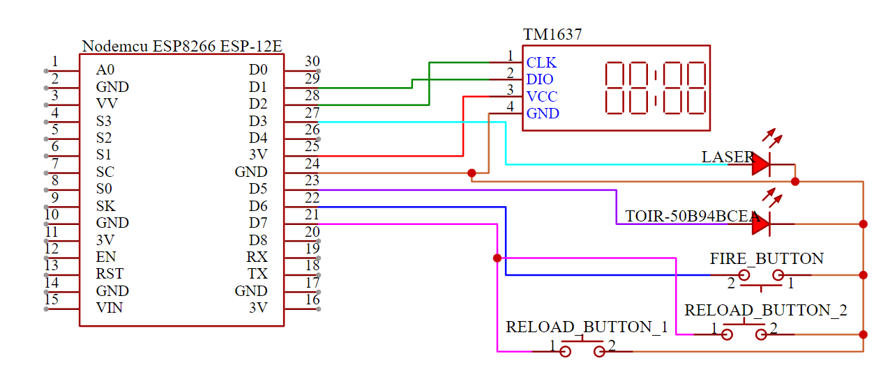

# arduino-shooting-gallery/gun

## Components

- ESP8266 ESP12-E (Other edition of ESP8266 should work.)
- TM1637 4 digit 7 segment
- Any kind of Laser
- TOIR-50b94bCEa Infraled transmitter
- Push buttons (HIGH on press, LOW on release)

## Schematic



## Configuration

in `DEFINE.h`

```cpp
#define AMMO_COUNT    20    // Ammo count each magazine
#define RELOAD_TIME   500   // Reload time (in ms)
#define FIRE_RATE     100   // Fire rate (in ms)
#define VISUAL_DELAY  25    // Visual display speed (in ms)
#define ISAUTO        false // Is this automatic
```
