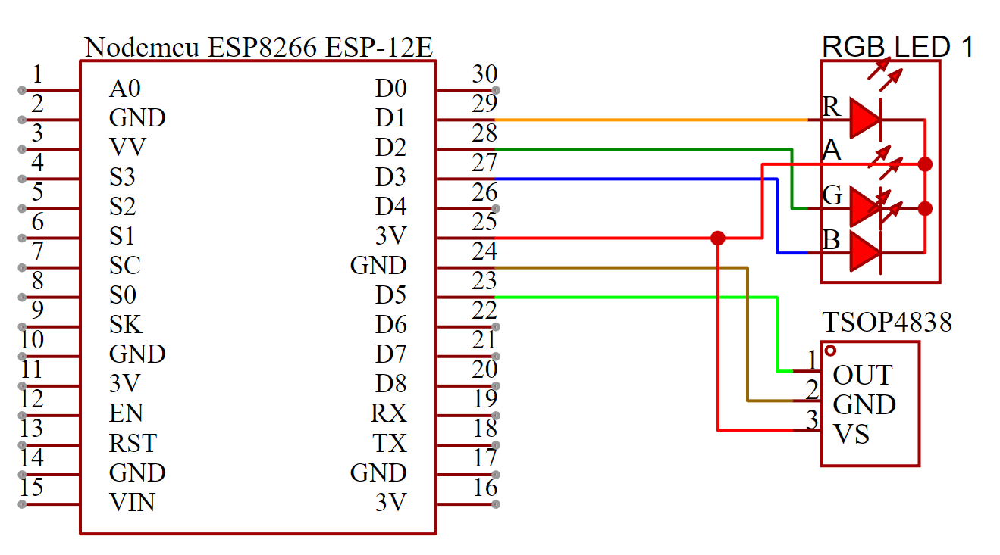

# arduino-shooting-gallery/target

## Components

- ESP8266 ESP12-E (Other edition of ESP8266 should work.)
- RGB LED *The code use common anode, if you wish to use common cathode just change from ...*

```cpp
void LEDSetColor(bool isROn,bool isGOn,bool isBOn) {
  digitalWrite(LED_R_PIN, !isROn);
  digitalWrite(LED_G_PIN, !isGOn);
  digitalWrite(LED_B_PIN, !isBOn);
}
```

*to ...*

```cpp
void LEDSetColor(bool isROn,bool isGOn,bool isBOn) {
  digitalWrite(LED_R_PIN, isROn);
  digitalWrite(LED_G_PIN, isGOn);
  digitalWrite(LED_B_PIN, isBOn);
}
```

- TSOP4838 Infraled Reciever (Other should do, but it should match your Infraled transmitter)

## Schematic



## LED signal

- RED: Connecting to Wi-Fi and Websocket
- BLUE: Connected
- GREEN: Shoot at me.

## Websocket API

- UP: Ready to be shot
- DOWN: Stop from being ready state.
